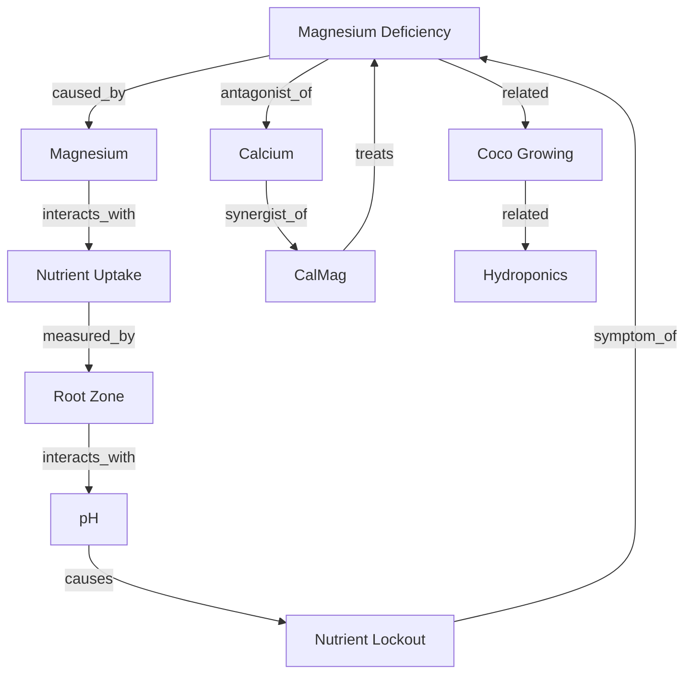

# SecretLeaf — Knowledge Operating System Report

> Final report for the Knowledge OS initiative. Consolidates the audit, the
> implemented foundation, and the roadmap for the remaining phases.
>
> Owner: Product Engineering · Status: Active · Date: 2026-06-02

Companion documents:
- `docs/KNOWLEDGE_SYSTEM_AUDIT.md` — Phase 0 deep system audit
- `docs/CANNABIS_EDITORIAL_STANDARD.md` — Phase 3 editorial framework

---

## 1. Executive summary

SecretLeaf's knowledge surface was a **code-bound static wiki**: ~8,500 lines of
hardcoded TypeScript (`apps/web/src/data/terpira/*.ts`) compiled into the bundle,
with no database representation, no graph, no persisted analytics, and no AI
substrate. This initiative replaces that foundation with a **normalized,
graph-ready, AI-ready Knowledge Operating System** backed entirely by Supabase.

**Delivered in this PR (the foundation):**

- A normalized 17-table schema (migration `202606020013_knowledge_os.sql`),
  validated end-to-end against a real Postgres instance.
- A typed cannabis knowledge graph with BFS traversal.
- A TypeScript data layer (types, repository, service) + 3 API endpoints.
- An automatic migration script (wiki → DB) producing idempotent seed + rollback
  SQL; it migrates the existing 37 articles, 121 tags, 71 sources, 75 FAQs.
- The editorial standard and this report.

**Roadmapped (foundation in place, build sequenced below):** semantic/vector
search, the recommendation engine, the design rebuild, and the AI knowledge
layer.

---

## 2. Current state → target state

| Dimension | Current (before) | Target (foundation delivered) |
|-----------|------------------|-------------------------------|
| Content store | Hardcoded TS in bundle | `knowledge_*` tables in Supabase |
| Article model | `TerpiraArticle` object | Normalized rows + typed JSON block body |
| Taxonomy | Embedded arrays | `knowledge_categories` / `tags` / `article_tags` |
| Relations | Flat `relatedSlugs: string[]` | Typed, weighted `knowledge_relations` graph |
| Sources | `sourceRegister` array | `knowledge_sources` + `knowledge_references` |
| Editorial | None (edit = deploy) | Status workflow, versions, reviews, contributors |
| Search | In-memory keyword | Postgres FTS now → vector/RAG next |
| Analytics | Plausible fire-and-forget | Persisted `knowledge_events` + `knowledge_metrics` |
| SEO | title/description only | JSON-LD (Article/FAQ/Breadcrumb/Entity) generator |
| AI | None | `knowledge_embeddings` (pgvector) + graph traversal |
| Tools | Implicit (context map) | Explicit `knowledge_tool_links` relation layer |

---

## 3. Entity-Relationship diagram

```mermaid
erDiagram
    knowledge_categories ||--o{ knowledge_articles : categorizes
    knowledge_categories ||--o{ knowledge_categories : parent_of
    knowledge_contributors ||--o{ knowledge_articles : authors
    knowledge_articles ||--o{ knowledge_faqs : has
    knowledge_articles ||--o{ knowledge_media : has
    knowledge_articles ||--o{ knowledge_tool_links : links
    knowledge_articles ||--o{ knowledge_versions : versioned_by
    knowledge_articles ||--o{ knowledge_reviews : reviewed_by
    knowledge_articles ||--o{ knowledge_embeddings : chunked_into
    knowledge_articles ||--|| knowledge_metrics : measured_by
    knowledge_articles ||--o{ knowledge_events : tracked_by
    knowledge_articles }o--o{ knowledge_tags : tagged
    knowledge_article_tags }o--|| knowledge_tags : maps
    knowledge_articles ||--o{ knowledge_references : cites
    knowledge_references }o--|| knowledge_sources : to
    knowledge_articles ||--o{ knowledge_relations : from
    knowledge_relations }o--|| knowledge_articles : to
```

### Table inventory (17)

Core: `knowledge_categories`, `knowledge_articles`, `knowledge_faqs`.
Taxonomy: `knowledge_tags`, `knowledge_article_tags`.
Sources: `knowledge_sources`, `knowledge_references`.
Graph: `knowledge_relations`.
Editorial: `knowledge_contributors`, `knowledge_versions`, `knowledge_reviews`.
Media: `knowledge_media`.
Tools: `knowledge_tool_links`.
Analytics: `knowledge_events`, `knowledge_metrics`.
AI: `knowledge_embeddings` (pgvector, graceful jsonb fallback).

---

## 4. Knowledge graph diagram (Phase 2)

The example traversal from the brief is expressible as typed, weighted edges:



Edges are stored in `knowledge_relations(from_article, to_article, relation_type,
weight)`. `traverseGraph()` (service layer) performs a bounded BFS, returning the
reachable subgraph for related-topics UI and AI context expansion.

---

## 5. Migration plan (Phase 11)

**Automated, no manual migration.**

1. Apply schema migration `supabase/migrations/202606020013_knowledge_os.sql`.
2. Run `node scripts/migrate-wiki-to-knowledge.mjs` to transform the legacy
   `wikiArticles` / `sourceRegister` / `categoryLabels` into:
   - `supabase/seed/knowledge_seed.sql` (idempotent `INSERT … ON CONFLICT`)
   - `supabase/seed/knowledge_rollback.sql` (batch-tagged deletes)
3. Apply the seed against Supabase.
4. Validate with `--validate` (referential integrity: slugs, sources, relations).

**Validation performed:** the schema + seed were applied to a real Postgres 16
instance. Results: 37 articles, 121 tags, 71 sources, 75 FAQs, 140 references,
101 relations, 176 article-tag links. Seed re-run is idempotent; rollback returns
the corpus to zero. Dangling legacy references/relations are skipped gracefully
(reported as warnings) rather than failing the load.

**Cutover (sequenced after this PR):** point the `/studies` and `/category` reads
at the repository (`lib/knowledge/db.ts`) behind a feature flag, verify parity,
then delete the hardcoded data modules.

---

## 6. Technical debt removed

- Content is no longer compiled into the bundle (removes the scaling ceiling).
- `relatedSlugs` flat lists replaced by a typed, weighted, queryable graph.
- `sourceRegister` duplication replaced by normalized sources + references.
- Search no longer re-indexes hardcoded arrays per request (FTS index in DB).
- Analytics no longer discarded — events are persisted for modelling.

---

## 7. Semantic search roadmap (Phase 5)

| Stage | Capability | Mechanism | Status |
|-------|-----------|-----------|--------|
| 0 | Keyword (legacy) | in-memory engine | exists |
| 1 | **Full-text** | Postgres `tsvector` GIN (`search_tsv`) | **delivered** |
| 2 | Semantic / vector | `pgvector` over `knowledge_embeddings` (ANN) | foundation ready |
| 3 | AI-assisted | LLM query understanding + reranking | roadmap |
| 4 | Graph-assisted | expand candidates via `knowledge_relations` | foundation ready |

Implementation order: backfill embeddings (chunk article body + FAQs) → hybrid
rank (FTS + cosine) → graph expansion of top-k → optional LLM rerank.

---

## 8. Design rebuild requirements (Phase 6)

The article surface must become a professional knowledge platform. Requirements
captured for the UI workstream (data already modelled): clean typography, sticky
navigation, reading progress, table of contents, knowledge cards, citations,
callouts, warning boxes, expert boxes, related articles, related diagnostics,
related calculators, mobile-first, dark-mode optimized. The block-typed body
(`callout` / `warning` / `expert_box` + the 16 template blocks) and
`knowledge_tool_links` provide the data contract these components render against.

---

## 9. Programmatic SEO (Phase 10)

`buildArticleJsonLd()` (service layer) generates a schema.org `@graph` with
**Article/Entity**, **FAQPage**, and **BreadcrumbList** nodes from DB rows. With
content in Supabase, article and category pages become programmatically
generable at scale (`generateStaticParams` sourced from the DB), and a
`sitemap.ts` can be driven from `knowledge_articles`. Entity schema is supported
via `knowledge_articles.entity_type`.

---

## 10. AI knowledge layer (Phase 9)

The schema is future-proofed for: **RAG** (`knowledge_embeddings` + graph
context), **AI diagnostics** (symptom/cause/treats relations), **recommendations**
(`knowledge_events` → `knowledge_metrics`), **anomaly detection** and
**benchmarking** (event aggregates). The typed graph is the differentiator: AI
systems traverse `causes`/`symptom_of`/`treats` edges rather than guessing from
free text.

---

## 11. Deployment checklist

- [ ] Review & apply migration `202606020013_knowledge_os.sql` to staging.
- [ ] Confirm `pgvector` availability (table degrades to jsonb if absent).
- [ ] Run `migrate-wiki-to-knowledge.mjs`; apply `knowledge_seed.sql`.
- [ ] Verify counts and run `--validate`; review warnings.
- [ ] Smoke-test `/api/knowledge`, `/api/knowledge/graph`, `/api/knowledge/events`.
- [ ] Confirm RLS: anon reads published only; staff (PROVIDER/TEAM/ADMIN) writes.
- [ ] Wire reads behind a feature flag; verify parity vs. legacy pages.
- [ ] Backfill embeddings (separate job) before enabling vector search.
- [ ] Promote to production; retire hardcoded data modules post-parity.

---

## 12. Risk analysis

| Risk | Likelihood | Impact | Mitigation |
|------|-----------|--------|------------|
| `pgvector` unavailable in target | Medium | Med | Guarded creation + jsonb fallback already in migration |
| Legacy data quality (dangling refs) | High | Low | Loader skips gracefully + reports warnings |
| Read cutover regressions | Medium | High | Feature-flagged dual-read + parity checks |
| RLS misconfiguration exposes drafts | Low | High | Validated policies: published-only public read |
| Embedding cost/latency | Medium | Med | Batch backfill, cache, hybrid rank fallback to FTS |
| Editorial throughput lag | Medium | Med | Workflow tables + standard enable non-eng authoring |

---

## 13. Remaining work

1. **Read cutover** of `/studies`, `/studies/[slug]`, `/category/[slug]` to the
   repository (feature-flagged) and retirement of hardcoded modules.
2. **Embeddings backfill** job + hybrid vector search endpoint (Phase 5 stage 2).
3. **Design rebuild** components against the block/tool data contract (Phase 6).
4. **Client analytics wiring**: emit `knowledge_events` (scroll, completion,
   tool/graph launches) and a scheduled `knowledge_metrics` roll-up (Phase 8).
5. **JSON-LD + sitemap** wired into the article/category routes (Phase 10).
6. **Recommendation engine** over the event store (Phase 9).

---

## 14. Conclusion

SecretLeaf no longer has to live with a wiki. The foundation of a **cannabis
knowledge operating system** is in place: normalized, graph-native, analytics-
backed, AI-ready, and migrated automatically from the existing corpus. The
remaining phases are sequenced, de-risked, and build on a schema that has been
validated end-to-end.
